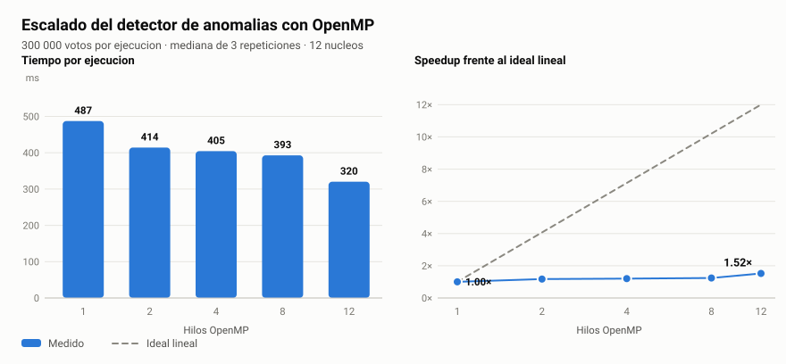
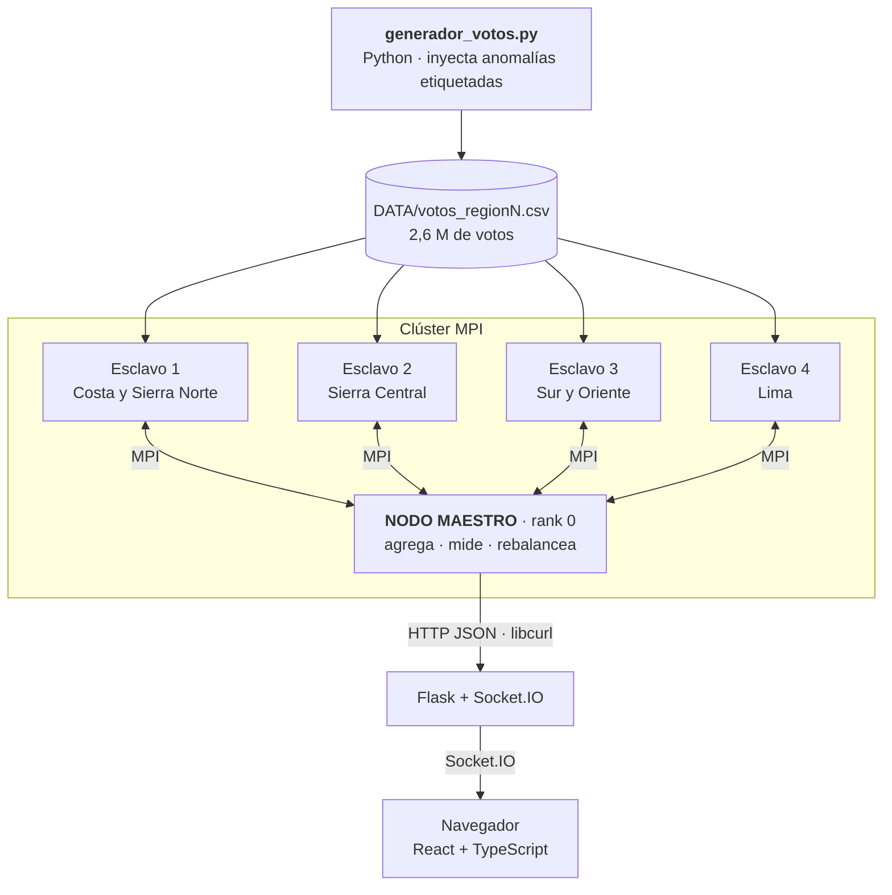
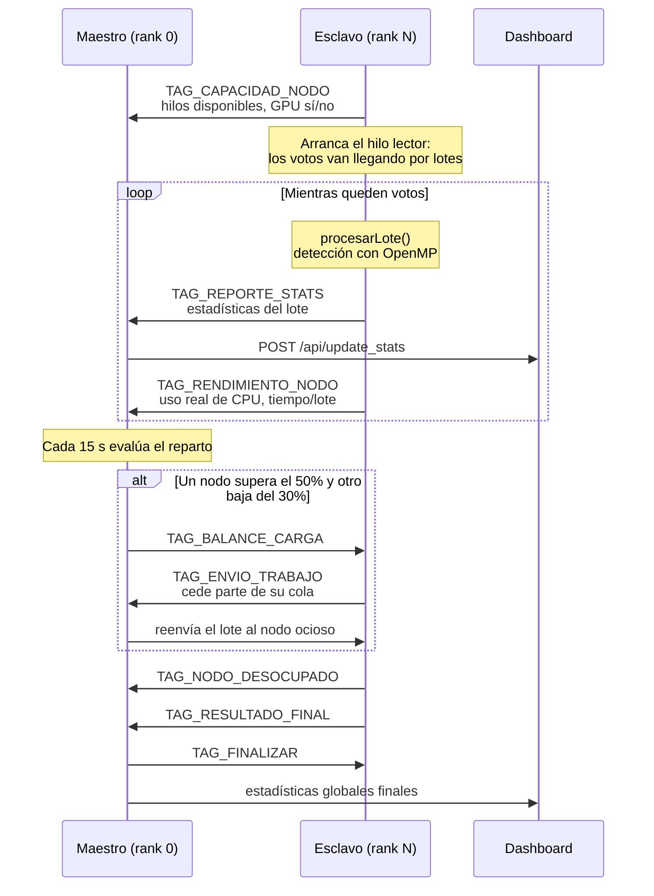
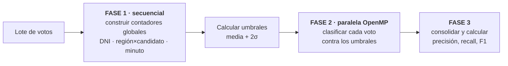
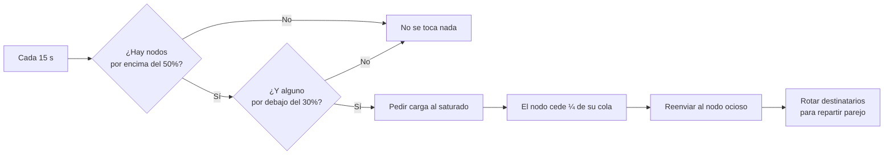
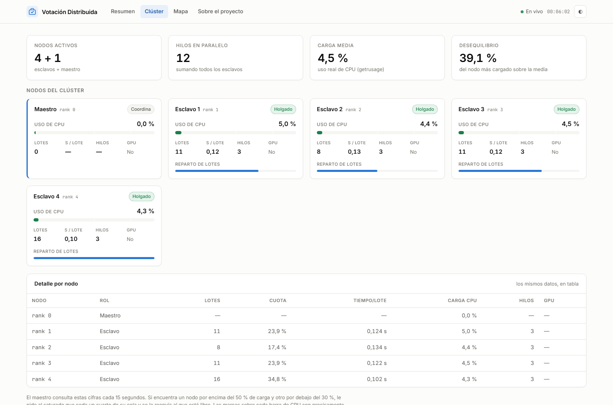
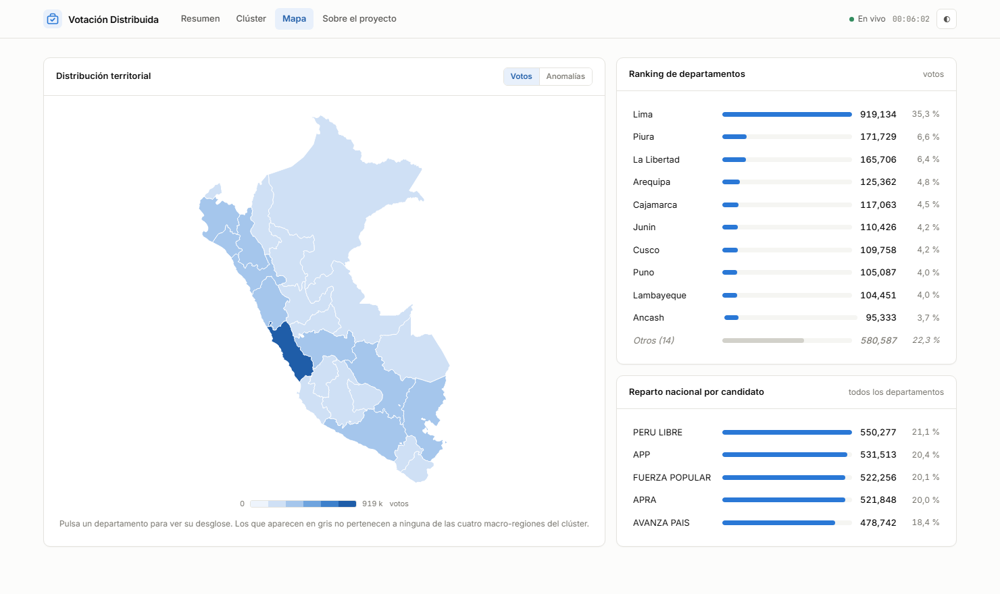

<div align="center">

# 🗳️ Sistema de Votación Electrónica Distribuida

**Procesa 2,6 millones de votos repartidos entre varios nodos y detecta fraude electoral en paralelo.**

Un clúster **MPI** reparte una jornada electoral peruana entre nodos heterogéneos,
cada uno analiza sus votos con **OpenMP** (o **CUDA** si tiene GPU), y un nodo maestro
agrega resultados y **rebalancea la carga en caliente** según el rendimiento real que mide de cada nodo.

[](https://github.com/gcdavidq/CPyD-Project/actions/workflows/ci.yml)


### 🔗 [**Ver la demo en vivo**](https://votacion-distribuida-dashboard.onrender.com)

*La demo reproduce una **ejecución real** del clúster, grabada evento a evento.*


</div>

---

## 📌 De un vistazo

| | |
|---|---|
| **Qué hace** | Simula una jornada electoral, la reparte entre nodos y detecta anomalías en paralelo |
| **Escala medida** | **2 604 636 votos** · 24 departamentos · 5 partidos · 4 nodos esclavos |
| **Paralelismo** | MPI *entre* nodos + OpenMP *dentro* de cada nodo + CUDA opcional |
| **Anomalías** | DNI duplicado · concentración sospechosa · flujo excesivo |
| **Rendimiento** | ~937 000 votos/s analizados con 12 hilos |
| **Balanceo** | Dinámico, basado en el uso real de CPU (`getrusage`) de cada nodo |
| **Panel** | SPA de React + TypeScript, con mapa coroplético y gráficos en SVG propios |

---

## 📊 Resultados reales medidos

Todos estos números salen de una ejecución real en un portátil de 12 núcleos, no son estimaciones.
El CSV en bruto está en [`benchmarks/resultados/`](benchmarks/resultados/) y se regenera con un comando.

<div align="center">
<picture>
  <source media="(prefers-color-scheme: dark)" srcset="docs/img/speedup-dark.svg">
  
</picture>
</div>

| Hilos | Tiempo | Speedup | Eficiencia |
|------:|-------:|--------:|-----------:|
| 1  | 487,2 ms | 1,00× | 100 % |
| 2  | 414,2 ms | 1,18× |  59 % |
| 4  | 404,5 ms | 1,20× |  30 % |
| 8  | 392,9 ms | 1,24× |  16 % |
| 12 | 320,2 ms | **1,52×** |  13 % |

> **El speedup es de 1,52×, no de 12×, y eso es un resultado, no un fallo.**
> El detector tiene una fase secuencial obligatoria: antes de poder clasificar
> nada hay que recorrer *todos* los votos para construir los contadores globales
> de DNI, de región×candidato y de flujo por minuto. Solo la segunda fase, la de
> clasificación, es paralela.
>
> Aplicando la ley de Amdahl a la medida (`S = 1 / ((1-p) + p/12) = 1,52`), la
> fracción efectivamente paralela es **p ≈ 0,37**. Es decir: el techo teórico de
> este diseño con infinitos hilos sería 1/(1-0,37) ≈ **1,6×**. Estamos a un 95 %
> de ese techo — el paralelismo funciona; lo que limita es la estructura del
> algoritmo. Ver [qué haría distinto](#-qué-haría-distinto).

### Ejecución completa del clúster

| Métrica | Valor |
|---|---|
| Votos procesados | 2 604 636 |
| Lotes completados | 46 |
| Duración de la jornada simulada | 133,4 s |
| Anomalías reales inyectadas | 125 900 (4,8 %) |
| Anomalías detectadas | 326 142 |
| **Recall** | **58,97 %** |
| **Precisión** | **22,76 %** |
| Accuracy | 88,35 % |
| F1-Score | 32,85 % |

> Los 133 s son el *tiempo de jornada simulada* (los votos van llegando a ritmo
> realista, no de golpe). El cómputo puro de un lote de 60 000 votos son
> ~0,27 s por nodo.

---

## 🏗️ Arquitectura



Y dentro de cada nodo esclavo, dos hilos trabajando a la vez sobre un buffer compartido:


### El protocolo entre nodos



---

## 🕵️ Cómo se detecta el fraude

Tres heurísticas, todas con **umbrales calculados a partir de los propios datos** — nada de constantes mágicas:

| Anomalía | Qué busca | Umbral |
|---|---|---|
| **DNI duplicado** | La misma persona votando varias veces | Cualquier DNI con más de una aparición |
| **Concentración** | Un candidato acaparando una región de forma anómala | `media + 2σ` sobre los pares región×candidato |
| **Flujo excesivo** | Una avalancha de votos en un mismo minuto | `media + 2σ` sobre los votos por minuto |

El `media + 2σ` corresponde al ~95 % de una distribución normal: se marca lo que
se sale estadísticamente del propio patrón de la elección, en vez de un número
fijo que habría que recalibrar para cada dataset.

**El algoritmo va en dos fases**, y esa división es justo lo que explica el speedup:



Dentro de la región paralela los contadores se consultan **solo con `.at()`**, que es
de lectura. Usar `operator[]` allí sería una condición de carrera: no es `const`, puede
insertar y provocar un *rehash* del mapa desde varios hilos a la vez. Hay
[un test](tests/test_anomalias.cpp) que ejecuta la detección con 1, 2, 4 y 8 hilos y
exige que el resultado sea idéntico.

---

## ⚖️ Balanceo de carga dinámico

El maestro no reparte a ciegas: cada nodo le informa de su **uso real de CPU**
(medido con `getrusage`, no estimado) y de su tiempo medio por lote.



Los nodos que se quedan sin trabajo se anuncian con `TAG_NODO_DESOCUPADO` y pasan
al principio de la cola de destinatarios.

---

## 🚀 Puesta en marcha

### Opción A — Docker (recomendada, no instala nada)

```bash
git clone https://github.com/gcdavidq/CPyD-Project.git
cd CPyD-Project
docker compose up --build
```

Eso levanta el dashboard en **http://localhost:5000** y un clúster MPI de 1 maestro
+ 4 esclavos que genera sus propios datos y empieza a procesarlos. Nada más que hacer.

Para cambiar la escala:

```bash
ESCALA_DATOS=50 NUM_ESCLAVOS=4 docker compose up --build
```

### Opción B — Compilación local (Linux o WSL2)

<details>
<summary><b>Pasos detallados</b></summary>

**1. Dependencias** (Ubuntu/Debian):

```bash
sudo apt update
sudo apt install -y build-essential cmake pkg-config \
  libopenmpi-dev openmpi-bin \
  libcurl4-openssl-dev libjsoncpp-dev \
  python3-venv python3-numpy
```

**2. Compilar:**

```bash
cmake -S . -B build -DCMAKE_BUILD_TYPE=Release
cmake --build build --parallel
```

Con GPU NVIDIA disponible: añade `-DUSE_CUDA=ON`.

**3. Generar los datos** (la escala 10 son ~2,6 M de votos y ~120 MB):

```bash
python3 SCRIPTS/generador_votos.py --todas --escala 10 --semilla 42
```

**4. Compilar el panel** (necesita Node 20+; con Docker esto se hace solo):

```bash
cd DASHBOARD_VOTACION/frontend
npm install && npm run build
cd ../..
```

> El build va a `DASHBOARD_VOTACION/static/dist/`, que **no está versionado**
> por ser un artefacto. Si te saltas este paso, Flask te lo recuerda con una
> página explicativa en vez de fallar con un error críptico.

**5. Arrancar el dashboard** (en otra terminal):

```bash
python3 -m venv .venv && source .venv/bin/activate
pip install -r DASHBOARD_VOTACION/requirements.txt
cd DASHBOARD_VOTACION && python app.py
```

**6. Lanzar el clúster:**

```bash
mpirun --oversubscribe -np 5 ./build/votacion 4
```

`-np 5` = 1 maestro + 4 esclavos. El `4` final son los hilos OpenMP por nodo.

Abre **http://localhost:5000/panel** y verás los datos entrando en vivo.

</details>

### Opción C — Clúster real de varias máquinas

```bash
cp host.txt.example host.txt   # pon las IPs de tus nodos
mpirun --hostfile host.txt -np 5 ./build/votacion 4
```

Requiere SSH sin contraseña entre las máquinas y la misma ruta de datos en todas.

---

## 🖥️ El panel

Cuatro vistas sobre los mismos datos en vivo:

| Vista | Qué muestra |
|---|---|
| **Resumen** | Cifras principales, evolución del recuento y matriz de confusión del detector |
| **Clúster** | Una ficha por nodo con su uso real de CPU, lotes procesados, hilos y GPU |
| **Mapa** | Coropleta del Perú por departamento, conmutable entre votos y anomalías |
| **Sobre el proyecto** | Explicación para quien llega sin contexto |

<table>
<tr>
<td width="50%"></td>
<td width="50%"></td>
</tr>
<tr>
<td align="center"><sub>Vista <b>Clúster</b> en tema oscuro · el desequilibrio de carga entre nodos, a la vista</sub></td>
<td align="center"><sub>Vista <b>Mapa</b> · coropleta propia en SVG, sin Leaflet</sub></td>
</tr>
</table>

Detalles que quizá no se ven a primera vista:

- **La vista de clúster hace visible el balanceador.** Las marcas sobre cada barra
  de CPU son los umbrales del 50 % y el 80 % que usa el maestro para decidir si
  redistribuye carga. La métrica de *desequilibrio* mide cuánto se aleja el nodo
  más cargado de la media: es la razón de ser del balanceador.
- **El mapa es SVG propio, no Leaflet.** Se proyectan los polígonos del GeoJSON
  directamente. Una coropleta comunica «dónde hay más votos» mucho mejor que
  marcadores idénticos, y evita una dependencia y las llamadas a un servidor de
  teselas.
- **Los gráficos están escritos a mano en SVG.** Sin librería de charts: control
  total de la escala, del comportamiento al pasar el ratón y del tema.
- **Un solo color de acento.** En un gráfico de una sola serie la categoría ya
  está en la etiqueta; pintar cada barra de un color distinto codificaría la
  posición, que no es un dato. El color solo aparece donde significa algo: la
  rampa secuencial del mapa y los estados de carga de los nodos.
- **Tema claro y oscuro**, cada uno con sus propios valores; el conmutador manda
  sobre la preferencia del sistema.

---

## ⚙️ Configuración

Nada está fijado en el código: todo se ajusta por variables de entorno. Copia
[`.env.example`](.env.example) a `.env` y edita lo que necesites.

| Variable | Por defecto | Para qué |
|---|---|---|
| `VOTACION_DATA_PREFIX` | `DATA/votos_region` | Prefijo de los CSV (el rank N lee `<prefijo>N.csv`) |
| `VOTACION_DASHBOARD_URL` | `http://localhost:5000` | Dónde publicar las estadísticas |
| `VOTACION_NUM_HILOS` | `4` | Hilos OpenMP por nodo |
| `VOTACION_HILOS_ALGORITMO` | `2` | Hilos del detector de anomalías |
| `VOTACION_TAM_LOTE` | `60000` | Votos por lote |
| `VOTACION_INTERVALO_BALANCEO_SEG` | `15` | Cada cuánto se evalúa el reparto |
| `VOTACION_VERBOSE` | `0` | Traza detallada (penaliza el rendimiento) |

---

## 🧪 Tests

```bash
cmake -S . -B build -DBUILD_TESTING=ON
cmake --build build --parallel
ctest --test-dir build --output-on-failure
```

**29 casos, 123 aserciones**, con [doctest](https://github.com/doctest/doctest) (cabecera única, sin dependencias externas):

| Suite | Qué comprueba |
|---|---|
| `test_protocolo` | La serialización binaria de MPI es exacta en ida y vuelta, incluidos los mapas anidados y los lotes vacíos |
| `test_estadisticas` | `combinar()` agrega bien y es asociativo (el maestro recibe los reportes en orden impredecible) |
| `test_anomalias` | Detecta lo que debe **y da el mismo resultado con 1, 2, 4 y 8 hilos** |
| `test_procesar_lote` | Ningún voto se pierde ni se duplica al procesar |
| `test_simulacion_llegada` | El parser de CSV sobrevive a CRLF y espacios sobrantes |

La suite se ejecuta además con `OMP_NUM_THREADS` a 1 y a 8: si el resultado
cambiara, habría una condición de carrera.

---

## 📈 Reproducir los benchmarks

```bash
./build/bench_deteccion DATA/votos_region1.csv 300000 3 \
    > benchmarks/resultados/speedup.csv

python3 benchmarks/graficar_speedup.py benchmarks/resultados/speedup.csv
```

Genera el CSV y regenera los SVG de este README (versión clara y oscura), sin
matplotlib ni ninguna otra dependencia.

---

## 🗂️ Estructura

```
├── main.cpp                    Punto de entrada: rank 0 → maestro, resto → esclavos
├── CMakeLists.txt              Build con MPI, OpenMP, CURL, jsoncpp y CUDA opcional
├── docker-compose.yml          Levanta dashboard + clúster de un tirón
│
├── VOTACION/                   Núcleo C++
│   ├── common/                 Configuración por entorno y estructuras de datos
│   ├── maestro/                Coordinación, agregación y cierre ordenado
│   ├── esclavo/                Ciclo de vida del trabajador
│   ├── deteccion/              Detector de anomalías (CPU OpenMP + kernel CUDA)
│   ├── procesamiento/          Orquesta detección → estadísticas del lote
│   ├── balanceo/               Redistribución dinámica de carga
│   ├── protocolo/              Serialización binaria para MPI
│   ├── estadisticas/           Agregación e informe (consola + HTTP)
│   ├── simulacion/             Lectura de CSV y llegada progresiva de votos
│   └── rendimiento/            Uso real de CPU con getrusage
│
├── DASHBOARD_VOTACION/         Panel web
│   ├── app.py                  Flask + Socket.IO · modos live y replay
│   ├── demo/                   Grabación de una ejecución real del clúster
│   ├── frontend/               SPA de React + TypeScript (Vite)
│   │   └── src/
│   │       ├── componentes/    Gráficos en SVG escritos a mano
│   │       ├── vistas/         Resumen · Clúster · Mapa · Sobre
│   │       └── datos/          Socket.IO, cálculos y formato
│   └── static/                 GeoJSON del Perú y el build de Vite
│
├── SCRIPTS/                    Generador de datos electorales sintéticos
├── tests/                      Batería doctest + CTest
├── benchmarks/                 Medición de escalado y generación de gráficos
└── .github/workflows/          CI: compila, testea y construye las imágenes
```

---

## 🤔 Decisiones técnicas

<details>
<summary><b>¿Por qué serialización binaria a mano y no una librería?</b></summary>

`Estadisticas` contiene `std::map` anidados y `LoteTrabajo` lleva strings de
longitud variable. MPI transmite búferes planos, así que hay que aplanarlos.
Meter Protobuf o Cap'n Proto habría añadido una dependencia pesada a un
proyecto cuyo objetivo era precisamente entender qué pasa por debajo.
El formato está en [`protocolo.cpp`](VOTACION/protocolo/protocolo.cpp) y
cubierto por tests de ida y vuelta.

</details>

<details>
<summary><b>¿Por qué el maestro sondea con MPI_Iprobe en vez de bloquearse?</b></summary>

El maestro tiene tres responsabilidades a la vez: recibir reportes, publicar
estadísticas cada N segundos y evaluar el balanceo cada 15 s. Con `MPI_Recv`
bloqueante se quedaría dormido esperando un mensaje y no podría rebalancear.
`MPI_Iprobe` permite atender mensajes *y* respetar los temporizadores en un
único hilo, sin la complejidad de un maestro multihilo.

</details>

<details>
<summary><b>¿Por qué la demo pública reproduce una grabación en vez de ejecutar MPI?</b></summary>

Un despliegue web gratuito da un contenedor con CPU limitada: no hay forma de
levantar ahí varios procesos MPI con red entre ellos. Las opciones eran mentir
(datos aleatorios) o ser honesto. El dashboard graba en `.jsonl` todo lo que le
llega del clúster real, con sus marcas de tiempo, y en modo `replay` lo
reproduce respetando los intervalos. Lo que se ve en la demo **son datos
auténticos**, solo que diferidos.

</details>

<details>
<summary><b>¿Por qué Socket.IO en modo threading y no eventlet?</b></summary>

`eventlet` y `gevent` parchean la librería estándar y van por detrás de las
versiones nuevas de Python — en Python 3.14 `eventlet` ni siquiera importa.
Con el modo `threading` el transporte cae a long-polling en lugar de WebSocket,
que para un refresco cada pocos segundos es indistinguible, y a cambio la
aplicación se instala en cualquier Python moderno.

</details>

---

## 🔭 Qué haría distinto

Cosas que las mediciones dejaron claras y que no he tocado para no desvirtuar el
diseño original del proyecto:

1. **Paralelizar la fase 1 del detector.** Es el techo de Amdahl del que habla la
   sección de resultados. Con contadores por hilo y una reducción al final, la
   fracción paralela subiría de ~0,37 a casi 1 y el speedup con ella.

2. **Revisar la heurística de concentración.** La precisión es del 22,8 %: el
   detector marca muchos votos legítimos. Tiene sentido — en una región donde un
   candidato es genuinamente popular, *todos* sus votos superan el umbral
   `media + 2σ`. La heurística confunde "popular" con "fraudulento". Debería
   comparar contra la distribución esperada de esa región, no contra la media
   global. El recall (59 %) indica que sí encuentra fraude; lo que falla es
   discriminar.

3. **Evitar copiar los votos entre fases.** El detector copia cada `Voto`
   (con sus cuatro `std::string`) a vectores por hilo y luego los consolida.
   Trabajar con índices en lugar de copias reduciría mucho la presión de memoria.

---

## ⚠️ Limitaciones conocidas

- **La ruta CUDA no se ejecuta en CI ni en la demo**: no hay GPU disponible. El
  kernel compila con `-DUSE_CUDA=ON` pero se ha probado solo en local.
- **El dashboard mantiene el estado en memoria**: un solo worker. Escalar
  horizontalmente exigiría Redis por detrás.
- **El login y el registro son decorativos**: no hay backend de autenticación.
  Son parte de la maqueta de interfaz, no del sistema distribuido.
- **La demo gratuita de Render se duerme** tras 15 min sin visitas. Un workflow
  programado la despierta cada 14 minutos.

---

## ⚖️ Aviso

Proyecto **académico** del curso de Computación Paralela y Distribuida.
**Todos los datos son sintéticos**, generados por
[`SCRIPTS/generador_votos.py`](SCRIPTS/generador_votos.py). No proceden de ninguna
elección real ni tienen relación con ningún proceso electoral del Perú. Los
nombres de partidos se usan únicamente para dar verosimilitud a la simulación.

Este sistema es un ejercicio de computación paralela: **no es, ni pretende ser,
software electoral apto para uso real.**

---

## 🌐 Despliegue

La demo pública se despliega en **Render** desde [`render.yaml`](render.yaml),
sin tarjeta de crédito. La imagen Docker tiene dos etapas: Node compila la SPA y
la imagen final (208 MB) solo lleva Python y los estáticos ya construidos.

```bash
git push                       # Render redespliega solo
```

Los pasos exactos, las comprobaciones y la solución de problemas están en la
**[guía de despliegue](docs/DESPLIEGUE.md)**.

Para levantarlo entero en local, incluido el clúster MPI real:

```bash
docker compose up --build      # dashboard en :5000 + 1 maestro + 4 esclavos
```

---

## 📚 Documentación adicional

- **[Guía de despliegue](docs/DESPLIEGUE.md)** — poner la demo pública en marcha paso a paso
- **[Tests manuales](tests/manual/README.md)** — los dos programas de diagnóstico que necesitan MPI vivo

---

## 📄 Licencia

[MIT](LICENSE) · [@gcdavidq](https://github.com/gcdavidq)
